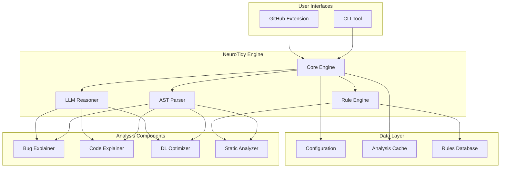

# Design Document: NeuroTidy

## Overview

NeuroTidy is an AI-powered developer productivity system that provides comprehensive analysis, explanation, and optimization capabilities for Python and Deep Learning code. The system combines static analysis, AI-powered insights, and domain-specific knowledge to help developers understand, debug, and optimize their ML/DL workflows.

The architecture follows a modular design with a central engine coordinating specialized components for bug explanation, code understanding, performance optimization, and static analysis. The system provides both CLI and GitHub integration interfaces, making it suitable for individual development and team collaboration workflows.

## Architecture

### High-Level Architecture



### Component Interaction Flow

The system follows a pipeline architecture where:

1. **Input Processing**: CLI or GitHub Extension receives code and analysis requests
2. **Parsing**: AST Parser generates structured representation of Python code
3. **Analysis Coordination**: Core Engine distributes analysis tasks to specialized components
4. **Rule Application**: Rule Engine applies static analysis rules with domain-specific knowledge
5. **AI Enhancement**: LLM Reasoner provides contextual insights and explanations
6. **Result Aggregation**: Core Engine combines results from all components
7. **Output Formatting**: Results are formatted for CLI display or GitHub comments

## Components and Interfaces

### Core Engine

**Purpose**: Central coordinator that manages analysis workflow and component interactions.

**Key Responsibilities**:
- Orchestrate analysis pipeline execution
- Manage component lifecycle and dependencies
- Handle configuration loading and validation
- Coordinate caching and performance optimization
- Aggregate results from multiple analysis components

**Interface**:
```python
class CoreEngine:
    def analyze_code(self, code: str, options: AnalysisOptions) -> AnalysisResult
    def explain_code(self, code: str, mode: ExplanationMode) -> CodeExplanation
    def optimize_code(self, code: str) -> OptimizationSuggestions
    def explain_error(self, error: ErrorContext) -> BugExplanation
```

### AST Parser

**Purpose**: Parse Python code into Abstract Syntax Trees for structural analysis.

**Key Responsibilities**:
- Generate AST representations of Python source code
- Extract semantic information about functions, classes, and control flow
- Identify tensor operations and ML/DL specific patterns
- Provide source location mapping for error reporting

**Interface**:
```python
class ASTParser:
    def parse_file(self, filepath: str) -> ParsedCode
    def parse_string(self, code: str) -> ParsedCode
    def extract_functions(self, ast: ParsedCode) -> List[FunctionNode]
    def extract_tensor_ops(self, ast: ParsedCode) -> List[TensorOperation]
```

### Bug Explainer

**Purpose**: Analyze error messages and stack traces to provide human-friendly explanations.

**Key Responsibilities**:
- Parse Python error messages and stack traces
- Identify root causes of runtime errors
- Generate educational explanations with learning tips
- Suggest specific fixes for common error patterns

**Interface**:
```python
class BugExplainer:
    def explain_error(self, error_msg: str, stack_trace: str, code: str) -> BugExplanation
    def identify_faulty_lines(self, stack_trace: str) -> List[int]
    def suggest_fixes(self, error_type: str, context: CodeContext) -> List[Fix]
```

### Code Explainer

**Purpose**: Provide multi-level explanations of code logic and functionality.

**Key Responsibilities**:
- Analyze code structure and logic flow
- Generate explanations at different complexity levels
- Explain ML/DL specific patterns and operations
- Provide context-aware documentation

**Interface**:
```python
class CodeExplainer:
    def explain_function(self, func: FunctionNode, mode: ExplanationMode) -> FunctionExplanation
    def explain_class(self, cls: ClassNode, mode: ExplanationMode) -> ClassExplanation
    def explain_training_loop(self, loop: LoopNode) -> TrainingLoopExplanation
```

### DL Optimizer

**Purpose**: Identify performance bottlenecks and optimization opportunities in ML/DL code.

**Key Responsibilities**:
- Detect inefficient tensor operations
- Identify missing performance optimizations
- Suggest vectorization and memory optimization
- Estimate performance impact of suggested changes

**Interface**:
```python
class DLOptimizer:
    def analyze_performance(self, code: ParsedCode) -> PerformanceAnalysis
    def suggest_optimizations(self, analysis: PerformanceAnalysis) -> List[Optimization]
    def estimate_impact(self, optimization: Optimization) -> PerformanceImpact
```

### Static Analyzer

**Purpose**: Apply rule-based analysis for code quality and best practices.

**Key Responsibilities**:
- Execute static analysis rules
- Detect anti-patterns and code smells
- Apply ML/DL specific linting rules
- Generate violation reports with severity levels

**Interface**:
```python
class StaticAnalyzer:
    def analyze_code(self, code: ParsedCode, rules: RuleSet) -> List[Violation]
    def apply_rule(self, rule: Rule, code: ParsedCode) -> List[Violation]
    def calculate_severity(self, violation: Violation) -> Severity
```

### Rule Engine

**Purpose**: Manage and execute static analysis rules with configuration support.

**Key Responsibilities**:
- Load and validate rule configurations
- Execute rules against parsed code
- Support custom rule definitions
- Manage rule priorities and dependencies

**Interface**:
```python
class RuleEngine:
    def load_rules(self, config: RuleConfig) -> RuleSet
    def execute_rules(self, rules: RuleSet, code: ParsedCode) -> List[RuleResult]
    def validate_rule(self, rule: Rule) -> ValidationResult
```

### LLM Reasoner

**Purpose**: Provide AI-powered contextual analysis and explanations.

**Key Responsibilities**:
- Generate intelligent code insights
- Enhance static analysis with contextual understanding
- Provide natural language explanations
- Support multiple explanation complexity levels

**Interface**:
```python
class LLMReasoner:
    def analyze_context(self, code: str, context: AnalysisContext) -> AIInsight
    def generate_explanation(self, code: str, mode: ExplanationMode) -> str
    def enhance_analysis(self, static_results: List[Violation]) -> List[EnhancedViolation]
```

## Data Models

### Core Data Structures

```python
@dataclass
class AnalysisOptions:
    include_optimization: bool = True
    include_explanation: bool = True
    explanation_mode: ExplanationMode = ExplanationMode.INTERMEDIATE
    rule_set: Optional[str] = None
    output_format: OutputFormat = OutputFormat.TEXT

@dataclass
class AnalysisResult:
    violations: List[Violation]
    optimizations: List[Optimization]
    explanations: List[CodeExplanation]
    performance_metrics: PerformanceMetrics
    processing_time: float

@dataclass
class ParsedCode:
    ast: ast.AST
    source_lines: List[str]
    functions: List[FunctionNode]
    classes: List[ClassNode]
    imports: List[ImportNode]
    tensor_operations: List[TensorOperation]

@dataclass
class Violation:
    rule_id: str
    severity: Severity
    message: str
    line_number: int
    column: int
    suggestion: Optional[str]
    performance_impact: Optional[float]

@dataclass
class Optimization:
    type: OptimizationType
    description: str
    code_location: CodeLocation
    estimated_improvement: float
    confidence: float
    suggested_code: Optional[str]

@dataclass
class BugExplanation:
    error_type: str
    root_cause: str
    faulty_lines: List[int]
    explanation: str
    learning_tips: List[str]
    suggested_fixes: List[Fix]

@dataclass
class CodeExplanation:
    element_type: str  # function, class, loop, etc.
    summary: str
    detailed_explanation: str
    complexity_level: ExplanationMode
    related_concepts: List[str]
```

### ML/DL Specific Models

```python
@dataclass
class TensorOperation:
    operation_type: str  # matmul, conv2d, etc.
    input_shapes: List[TensorShape]
    output_shape: TensorShape
    device: str
    requires_grad: bool
    line_number: int

@dataclass
class TrainingLoopAnalysis:
    loop_type: str  # epoch, batch, etc.
    optimization_steps: List[OptimizationStep]
    loss_computation: LossComputation
    gradient_flow: GradientFlow
    performance_bottlenecks: List[Bottleneck]

@dataclass
class PerformanceImpact:
    metric: str  # speed, memory, etc.
    current_value: float
    optimized_value: float
    improvement_percentage: float
    confidence: float
```

### Configuration Models

```python
@dataclass
class RuleConfig:
    enabled_rules: List[str]
    disabled_rules: List[str]
    custom_rules: List[CustomRule]
    severity_overrides: Dict[str, Severity]

@dataclass
class NeuroTidyConfig:
    analysis_options: AnalysisOptions
    rule_config: RuleConfig
    llm_config: LLMConfig
    output_config: OutputConfig
    cache_config: CacheConfig
```

## Error Handling

### Error Categories

1. **Input Validation Errors**: Invalid file paths, malformed code, unsupported file types
2. **Parsing Errors**: Syntax errors in Python code, AST generation failures
3. **Analysis Errors**: Rule execution failures, LLM API errors, memory limitations
4. **Configuration Errors**: Invalid rule configurations, missing dependencies
5. **System Errors**: File system access issues, network connectivity problems

### Error Handling Strategy

**Graceful Degradation**: When individual components fail, the system continues with available analysis results rather than complete failure.

**Error Recovery**: Implement retry mechanisms for transient failures (network issues, temporary resource constraints).

**User Feedback**: Provide clear, actionable error messages with suggested resolutions.

**Logging**: Comprehensive logging for debugging and monitoring system health.

```python
class NeuroTidyError(Exception):
    """Base exception for NeuroTidy errors"""
    pass

class ParseError(NeuroTidyError):
    """Raised when code parsing fails"""
    pass

class AnalysisError(NeuroTidyError):
    """Raised when analysis components fail"""
    pass

class ConfigurationError(NeuroTidyError):
    """Raised when configuration is invalid"""
    pass
```

## Testing Strategy

### Dual Testing Approach

The testing strategy combines unit testing for specific functionality and property-based testing for comprehensive validation of system behavior across diverse inputs.

**Unit Testing Focus**:
- Component integration points and API contracts
- Specific error handling scenarios and edge cases
- Configuration loading and validation logic
- CLI command parsing and output formatting

**Property-Based Testing Focus**:
- Universal correctness properties across all code inputs
- Analysis consistency and deterministic behavior
- Performance characteristics under varying loads
- Rule application correctness across code patterns

### Property-Based Testing Configuration

- **Testing Library**: Hypothesis for Python property-based testing
- **Test Iterations**: Minimum 100 iterations per property test
- **Test Tagging**: Each property test references its design document property
- **Coverage**: All correctness properties implemented as property-based tests

### Testing Infrastructure

**Test Data Generation**: Automated generation of diverse Python code samples including ML/DL patterns, error scenarios, and edge cases.

**Performance Testing**: Benchmarking analysis speed and memory usage across different code sizes and complexity levels.

**Integration Testing**: End-to-end testing of CLI commands and GitHub integration workflows.

**Regression Testing**: Automated testing to ensure new features don't break existing functionality.

## Correctness Properties

*A property is a characteristic or behavior that should hold true across all valid executions of a system—essentially, a formal statement about what the system should do. Properties serve as the bridge between human-readable specifications and machine-verifiable correctness guarantees.*

### Property 1: Bug Explanation Completeness
*For any* Python error message and stack trace, the Bug_Explainer should generate explanations that include root cause analysis, faulty line identification, and learning tips for prevention.
**Validates: Requirements 1.1, 1.3, 1.4**

### Property 2: Tensor Error Analysis
*For any* tensor-related RuntimeError (dimension mismatches, device placement, batch size issues), the Bug_Explainer should detect the specific error type and provide domain-specific explanations with suggested fixes.
**Validates: Requirements 1.2, 1.5**

### Property 3: Code Explanation Consistency
*For any* Python code and explanation mode (Beginner, Intermediate, Advanced), the Code_Explainer should generate explanations with content and verbosity appropriate to the specified mode.
**Validates: Requirements 2.1, 2.4, 2.5, 2.6**

### Property 4: Function and Class Explanation Structure
*For any* Python function or class, explanations should include purpose, parameters, return values, and side effects in a structured format.
**Validates: Requirements 2.2**

### Property 5: ML Pattern Recognition
*For any* code containing training loops or custom loss functions, the Code_Explainer should identify and explain ML-specific patterns including training phases, loss computation, and mathematical operations.
**Validates: Requirements 2.3, 2.7**

### Property 6: Tensor Operation Optimization Detection
*For any* code containing tensor operations, the DL_Optimizer should detect inefficient operations and suggest vectorized alternatives with performance impact estimates.
**Validates: Requirements 3.1, 3.7**

### Property 7: Performance Context Detection
*For any* inference code, training code, or data processing code, the DL_Optimizer should identify context-specific optimizations (no_grad for inference, mixed precision for training, caching for recomputation).
**Validates: Requirements 3.2, 3.5, 3.8**

### Property 8: Data Flow Optimization
*For any* code with CPU-GPU transfers or batch processing, the DL_Optimizer should identify unnecessary transfers and suboptimal batch handling with suggested improvements.
**Validates: Requirements 3.4, 3.6**

### Property 9: Loss Function Validation
*For any* loss function usage in ML code, the DL_Optimizer should validate appropriateness for the task context and suggest corrections for mismatched loss functions.
**Validates: Requirements 3.3**

### Property 10: Static Analysis Rule Application
*For any* Python code, the Static_Analyzer should apply appropriate rules and generate violations with rule identifiers, explanations, and severity-based prioritization.
**Validates: Requirements 4.1, 4.5, 4.6**

### Property 11: ML-Specific Rule Detection
*For any* code containing ML patterns (training loops, model evaluation, tensor operations), specific rules (NT001, NT014, NT027) should trigger when corresponding anti-patterns are detected.
**Validates: Requirements 4.2, 4.3, 4.4**

### Property 12: AI-Enhanced Analysis
*For any* code when AI-assisted analysis is enabled, the LLM_Reasoner should supplement rule-based findings with contextual insights beyond basic static analysis.
**Validates: Requirements 4.7**

### Property 13: Semantic Analysis Depth
*For any* code structure, the Static_Analyzer should perform semantic-aware analysis including naming consistency, readability scoring, and ML-specific pattern detection.
**Validates: Requirements 5.1, 5.2, 5.3, 5.4**

### Property 14: Refactoring and Documentation Suggestions
*For any* code with improvement opportunities, the Static_Analyzer should provide specific refactoring recommendations and suggest type hints and documentation improvements.
**Validates: Requirements 5.5, 5.6**

### Property 15: CLI Command Functionality
*For any* valid Python file and CLI command (analyze, explain, optimize), the CLI_Tool should execute successfully and display results in the requested format with proper error handling.
**Validates: Requirements 6.1, 6.2, 6.3, 6.5, 6.6**

### Property 16: CLI Argument Processing
*For any* command-line arguments including file paths, directories, and configuration options, the CLI_Tool should parse and process them correctly.
**Validates: Requirements 6.4, 6.7**

### Property 17: GitHub Integration Automation
*For any* pull request with Python file changes, the GitHub_Extension should automatically trigger analysis and post appropriate inline comments and reviews.
**Validates: Requirements 7.1, 7.2, 7.5**

### Property 18: GitHub Educational Integration
*For any* analysis results with optimization opportunities or educational insights, the GitHub_Extension should include performance impact estimates and learning tips in PR comments.
**Validates: Requirements 7.3, 7.4**

### Property 19: Configuration Respect
*For any* repository-specific or user-defined configuration, both CLI_Tool and GitHub_Extension should load and apply settings correctly.
**Validates: Requirements 7.6, 6.7**

### Property 20: Core Engine Coordination
*For any* analysis request, the NeuroTidy_Engine should coordinate all components (AST_Parser, Rule_Engine, LLM_Reasoner, analysis components) and aggregate results correctly.
**Validates: Requirements 8.1, 8.2, 8.3, 8.4**

### Property 21: System Extensibility and Performance
*For any* plugin additions or large codebase processing, the NeuroTidy_Engine should support extensions correctly and handle files efficiently with appropriate memory management.
**Validates: Requirements 8.5, 8.6, 9.2, 9.4, 9.6**

### Property 22: Caching and Dynamic Configuration
*For any* unchanged files with caching enabled or configuration changes, the system should skip redundant analysis and reload settings without restart.
**Validates: Requirements 8.7, 9.3**

### Property 23: Efficient Analysis Processing
*For any* tensor operation analysis or multiple analysis modes, the system should process efficiently without loading actual tensor data and avoid redundant parsing.
**Validates: Requirements 9.5, 9.6**

### Property 24: Configuration Loading and Customization
*For any* configuration file with custom rules, preferences, or thresholds, the system should load settings correctly and apply customizations to analysis behavior.
**Validates: Requirements 10.1, 10.2, 10.3, 10.4, 10.5, 10.6**